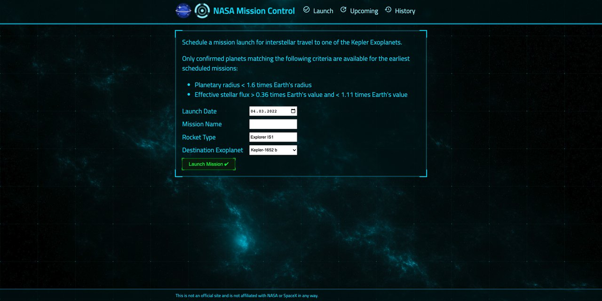

# nasa-mission-control

> *IN DEVELOPMENT*

The aim of the project is to schedule a mission launch for interstellar travel to one of the Kepler Exoplanets. Only confirmed planets matching the following criteria are available for the earliest scheduled missions:
- Planetary radius < 1.6 times Earth's radius
- Effective stellar flux > 0.36 times Earth's value and < 1.11 times Earth's value

The project is a showcase of a full-stack JavaScript application, enriched with multiple technologies, frameworks & concepts:

- Node.js
- Express
- API
- CORS
- Logging
- Jest
- Supertest
- React
- NPM scripting
- ...

*This is not an official site and is not affiliated with NASA or SpaceX in any way.*

